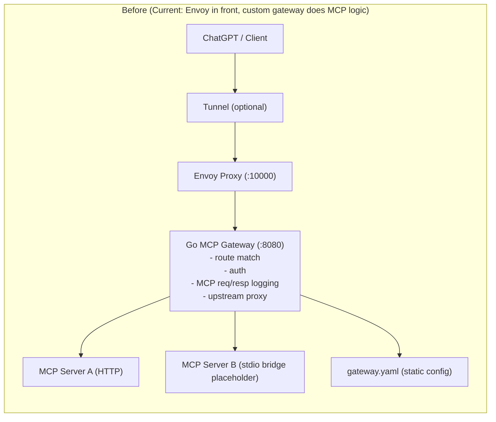
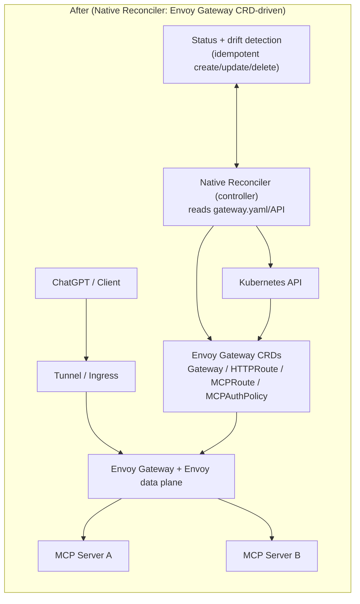

# Architecture Decisions (Phase 0)

Date: 2026-02-06

## ADR-001: Control Path

Decision:
- Use Envoy Gateway CRD-driven control path in v1 (`MCPRoute`, `MCPAuthPolicy` mapping), not raw xDS management.

Why:
- Faster time to a usable gateway.
- Better Kubernetes operator ergonomics.
- Aligns with Envoy Gateway MCP API direction.

## ADR-002: v1 Auth Defaults

Decision:
- Deny by default (`auth.requireAuth: true` by default).
- v1 route auth types: `apiKey`, `jwt`, `none`.

Why:
- Prevent accidental public exposure.
- Keep policy model minimal and explicit for first release.

## ADR-003: v1 Tenant Model

Decision:
- v1 is single-tenant by default.
- Multi-tenant RBAC and workspace boundaries deferred to post-MVP.

Why:
- Keeps initial UX and setup simple.
- Avoids premature complexity that blocks 10-minute deploy goal.

## ADR-004: Transport Coverage

Decision:
- v1 supports streamable HTTP and stdio (via adapter bridge contract).
- SSE compatibility as optional fallback path where client needs it.

Why:
- Covers practical migration path for existing MCP servers.
- Limits protocol complexity in initial implementation.

## Current vs Native Reconciler Architecture

### Before (Current): Envoy Front Proxy + Custom Gateway Runtime

Explanation:
- Envoy is currently a stable ingress/reverse proxy layer.
- The Go gateway handles MCP-aware behavior (routing, auth, transport handling, logging).
- Configuration is mostly file-driven (`gateway.yaml`), with local compose wiring.

### After (Target): Native Reconciler + Envoy Gateway CRD Data Plane

Explanation:
- The controller/reconciler becomes the control plane component.
- Desired state is expressed as Envoy Gateway CRDs and continuously reconciled.
- Envoy Gateway becomes the primary policy/routing data plane, reducing custom gateway runtime responsibilities.

### Key Difference

- Before: custom gateway is both control+data brain; Envoy is mainly passthrough ingress.
- After: reconciler manages desired state; Envoy Gateway CRDs and data plane enforce routing/policy natively.
